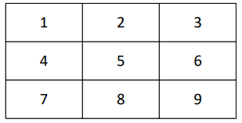

# CAD-Project
In this project I've built a driver that synchronises the fpga with a vga monitor that has a pixel clock of 25Mhz and a 640x400 resolution. The main goal of this project was to seperate my screen into 9 equal subsections of the visible area, where you could select which subsection you wanted by pressing numbers 1 - 9 from your keyboard and letters R, G, B for adding color. 
For example:

if you type 1, r, 7, b, 5, g then this will be the output:

As an added bonus, we added a Greek flag when you press the letter Y, the L button makes the colors of the subsections move counter clock wise, the Q button resets the the previous inputs, and the Y button creates different shades of red in sections 1,2,3,6,9,8,7,4 where you can make them move if you press L.
The FPGA clock is @100MHz.
